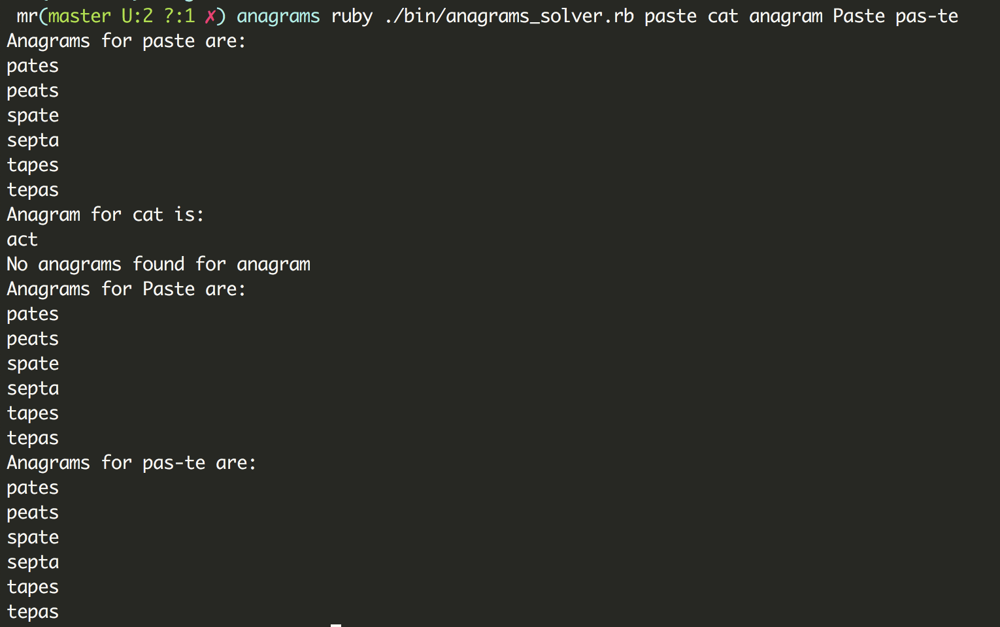
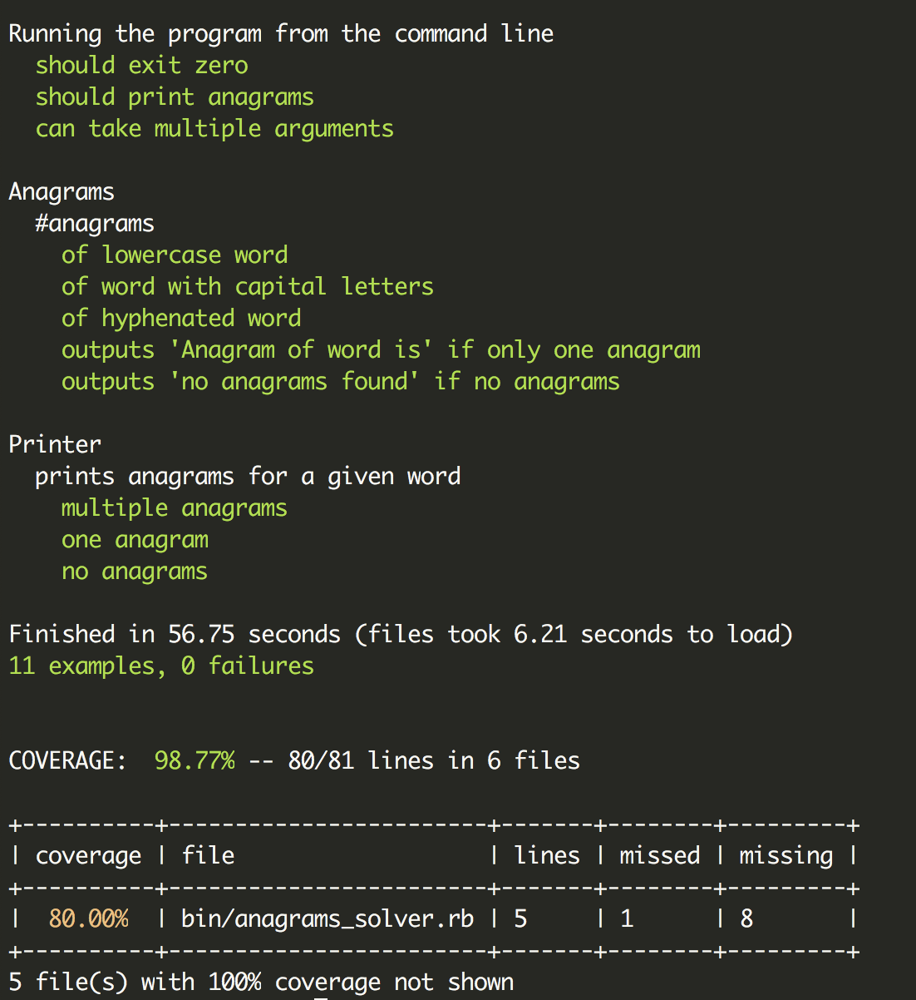

# Anagrams

[Motivation](#motivation) | [Build status](#build-status) | [Technologies](#technologies) | [Running the App](#running-the-app) | [Running tests](#running-tests)  | [Approach](#approach)  

----
A simple interactive application which can solve anagrams.

##  <a name="motivation">**Motivation**</a>

A tech test done as part of the interview for a junior developer role.

##  <a name="build-status">**Build Status**</a>

##  <a name="technologies">**Technologies**</a>
- Ruby
- RSpec
- Rubocop
- Simplecov

##  <a name="running-the-app">**Running the app**</a>

- Clone this repository:
   `git clone https://github.com/m-rcd/anagrams/`

- Go into the repository: `cd anagrams`

- Run `bundle install`

- Run the app:

  `ruby ./bin/anagrams_solver.rb <word>`

  Replace `<word>` with any word you like(can add multiple words)

##  <a name="running-tests">**Running tests**</a>

Run `rspec` in your terminal

##  <a name="approach">**Approach**</a>

- I used TDD to solve this challenge.

- I first started with a function `permutations` which would split the word and get an array of letters and get all the possible permutations of that word using ruby permutation method.

- As the wordlist is very large, I decided to use binary search instead of looping over the array. This would allow me to search the list quickly and more efficiently.
  - To do that, I first created my own function that takes an array and a word.
    - I assigned 2 variables `low` and `high`  to `0` and `array.length - 1` respectively. These would create a range which can be change as the search goes on. I created a third variable `mid` which is the average of `low` and `high`. I decided to use `(low + high) >> 1` syntax as `(low + high) / 2` can cause errors in the case of integer overflow.
    - I used the spaceship operator `<=>` to compare array[mid] and the word
    - I used a case statement that change the range from `(low..high)` to `(low..mid-1)` or `(mid+1..high)` depending on whether the word is bigger or smaller than array[mid].

  - I then found that there is a built in ruby function `bsearch` which would do that in one line of code.

- I then created the function `anagrams` which would return a list of all possible anagrams of the word contained in the wordlist.
- I added a private function `#printer` to improve user experience. I then decided to move this function into its own class to abide by the Single Responsibility rule.
